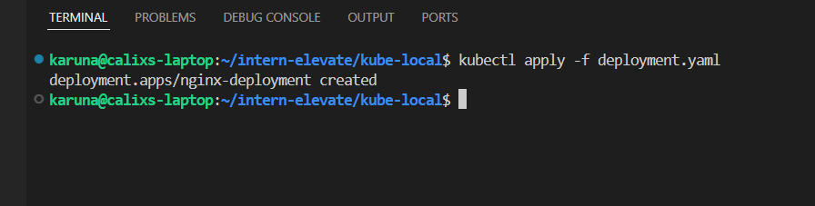
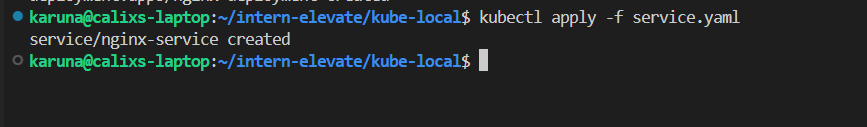
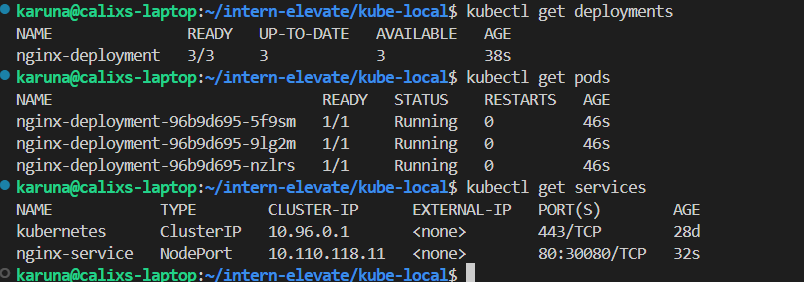

# Task 5: Local Kubernetes Deployment with Minikube

## Objective
Deploy and manage a simple application on a local Kubernetes cluster using **Minikube**, **kubectl**, and **Docker**.

---

## Prerequisites

- **Minikube** installed and running
- **kubectl** configured for the Minikube cluster
- **Docker** available if building custom images (optional)

---
## create a 2 files for deployment and service 
## apply these files using #kubectl 
## commands
## kubectl apply -f deployment.yaml

## kubectl apply -f service.yaml

once the deployment is successfull use these commands to check pods and deployments
## kubectl get pods 

